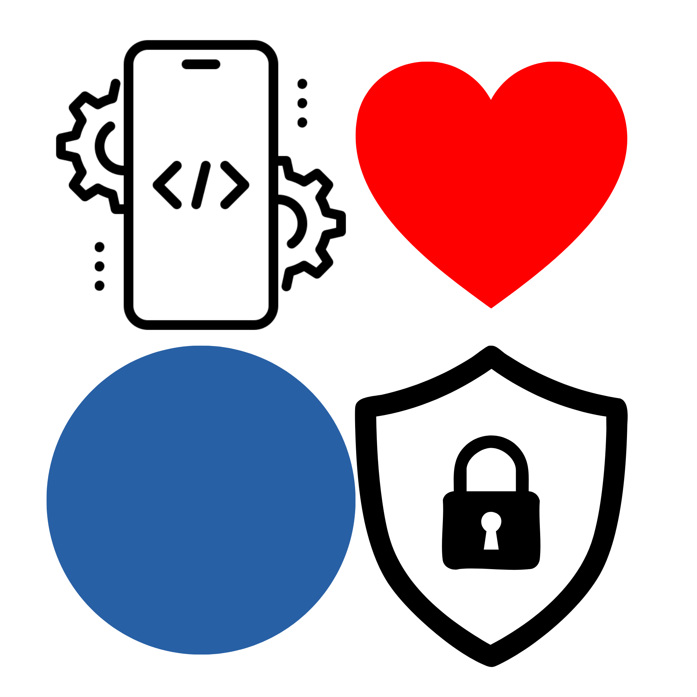
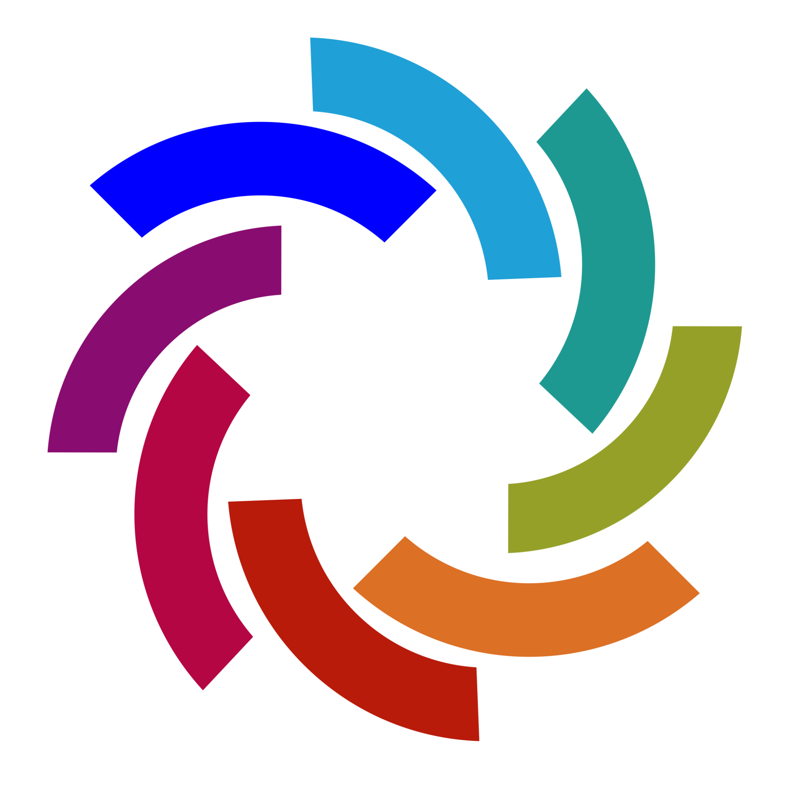
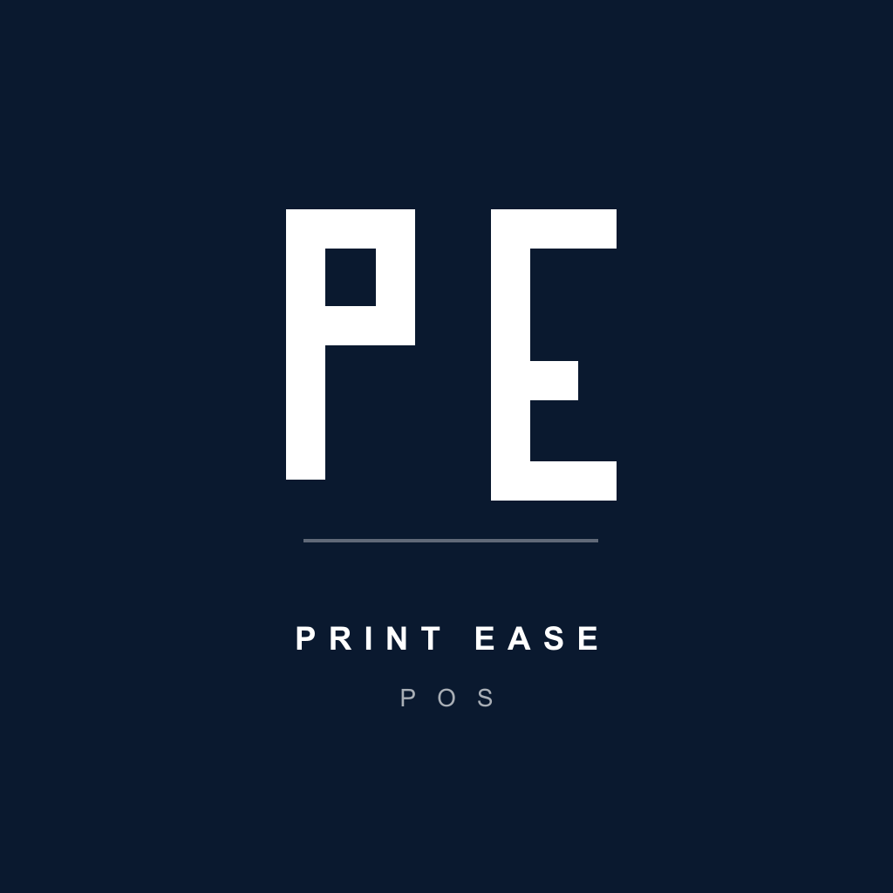

<div align="center">
  
  <h1 align="center" style="color:#D633E1; font-family: serif; font-style: italic; margin-top: 10px;">Nii Abe</h1>
  <p align="center">
    <a href="https://github.com/niiabe?tab=repositories" target="_blank"></a>
    <a href="https://www.youtube.com/@LocalInfoMaker" target="_blank"></a>
  </p>
  <p align="center"><strong>Web Developer · Graphic Designer · Video/Motion Artist · Mobile App Developer</strong></p>
</div>

<br>

<div align="center">
  <a href="https://niiabe.github.io/"></a>
  
  
</div>

---

## About

A single-page responsive portfolio showcasing my work across **Web Development**, **Graphic Design**, **Video/Motion**, and **Mobile App** projects. Built with **Bootstrap 4** and **Tailwind CSS**, featuring a Netflix-style horizontal scroll layout, project modals, and a fixed sidebar.

---

## Projects

### Web Development
| Project | Description | Link |
|---------|-------------|------|
| WhatsApp Widget Generator | JavaScript WhatsApp widget for websites | [View](https://whatsappwidgetgenerator.vercel.app/) |
| Nova Nsawa | Funeral donation platform landing page | [View](https://nsawa.vercel.app/) |
| JS QR Code Generator | Dynamic QR code generator | [View](https://qrcodegenjs.vercel.app/) |
| Achimota App Landing Page | Centenary app landing page | [View](https://oaa-two.vercel.app/) |
| Car Booking (Static) | Static car booking interface | [View](https://carbooking-phi.vercel.app/) |
| Math Camp | Interactive arithmetic learning app | [View](https://mathcamp.vercel.app/) |
| Lucky Lotto | Lotto predictions & statistics | [View](https://lucky-lotto-website.vercel.app/) |
| SOHI NGO | NGO awareness website | [View](https://sohi-9c3c0.web.app/) |
| Improp NGO | NGO initiative showcase | [View](https://improp-746b3.web.app/) |
| McWence Safety | Professional safety solutions site | [View](https://mcwence.web.app/) |

### Mobile App
<div align="center">
  <table>
    <tr>
      <td align="center" width="200">
        <br>
        <strong>CampBell Kiosk</strong><br>
        <sub>Android kiosk app with app whitelisting, admin panel, and remote config</sub><br>
        <a href="https://github.com/niiabe/CampbellKiosk">GitHub</a>
      </td>
      <td align="center" width="200">
        <br>
        <strong>HappyLotto POS</strong><br>
        <sub>Flutter lottery POS app with thermal printing and QR codes</sub><br>
        <a href="https://github.com/niiabe/happy_lotto">GitHub</a>
      </td>
      <td align="center" width="200">
        <br>
        <strong>PrintEase POS</strong><br>
        <sub>Offline-first Flutter thermal receipt printer app</sub><br>
        <a href="https://github.com/niiabe/PrintEase-POS">GitHub</a>
      </td>
      <td align="center" width="200">
        <br>
        <strong>YtMusix</strong><br>
        <sub>YouTube Music Streamer — Flutter audio streaming</sub><br>
        <a href="https://github.com/niiabe/ytmusix-flowos">GitHub</a>
      </td>
    </tr>
  </table>
</div>

### Graphic Design
| Project | Tool | Link |
|---------|------|------|
| CampBell Kiosk Logo | Custom | [View](https://github.com/niiabe/CampbellKiosk) |
| Adwoa Kami Charity Foundation | Canva | [View](https://www.canva.com/design/DAG7YDxBp6M/9tETjVjfKeUTAk6N3QBswA/view) |
| SOHI with NRSA | Canva | [View](https://www.canva.com/design/DAFjwGECJO4/ozLBtydsp-POJzh3ai6XQA/view) |
| Green Ghana Day | Canva | [View](https://www.canva.com/design/DAFlUm0WQxU/ERf1wNOMpXjwb4uZTvOrlw/view) |
| Girl Child Hygiene | Canva | [View](https://www.canva.com/design/DAFjayeFZOc/k0uF1y4F0oneYcmQRCiedQ/view) |
| LinkedIn Poster Redesign | Canva | [View](https://www.canva.com/design/DAFjkL68670/nGWe0Y2gHfk4cl3BugIhNw/view) |
| Smino Social Media Poster | Canva | [View](https://www.canva.com/design/DAFzYQm5LPI/NjXJ4VmCTJqAnTAm6die1g/view) |

### Video/Motion
| Project | Tool | Link |
|---------|------|------|
| Lomabs Drink | Canva | [View](https://www.canva.com/design/DAHFYHg7PzU/TlWjY3b3ceL1NmWNVmsa8Q/watch) |
| FnF Solutions | Canva | [View](https://www.canva.com/design/DAG1ynIQld4/Ujp5Ge8izh-W-qR8iXYQaA/watch) |
| Manye Kpatashie Sobolo | Canva | [View](https://www.canva.com/design/DAG5seJdzAo/B4W-O6I0o-wEaZ9RmPY5vA/watch) |
| Golden Kibble | Canva | [View](https://www.canva.com/design/DAG4AbTk41o/sMwyzJs0SQ7-9KZsYx96Jw/watch) |
| Chancellor's Poodles | Canva | [View](https://www.canva.com/design/DAG3V1p2vO4/p-WSmBEqY37ghg1OwMQKGQ/watch) |
| Achimota App Walkthrough | Canva | [View](https://www.canva.com/design/DAGsr0cN-Zo/AgjJoZK3H9kIPy3MN-TzmA/watch) |
| Road Safety Campaign | Canva | [View](https://www.canva.com/design/DAFjoVt8uNY/1-euYbwPn5cTemACFSUwKg/watch) |
| mCelerium Walkthrough | Canva | [View](https://www.canva.com/design/DAGrdWxR_vA/owOYncHtLTtKWo5-1jfUZA/watch) |
| SDG 13 Quotes | Canva | [View](https://www.canva.com/design/DAFnYCF0tpI/BAhwgyX7elprT9sxds4ggA/watch) |
| Lotto Matrix App Setup | Canva | [View](https://www.canva.com/design/DAGnXIHAbeQ/JMh-Bl8omwlW8qhrd5xp-g/watch) |
| Breast Cancer Awareness | Canva | [View](https://www.canva.com/design/DAFyjgpPDW8/HemLjJf97yh9vlnce76PQQ/watch) |

---

## Features

- **Fixed Sidebar** — Profile info, social links, and section navigation
- **Horizontal Project Carousels** — Netflix-style scrollable cards per category
- **Scroll Navigation Arrows** — Interactive left/right arrows for easy browsing
- **Project Modals** — Click any card to view full details in a popup
- **SEO Optimized** — Meta tags, semantic HTML, open graph ready
- **Responsive** — Adapts to desktop and mobile with optimized layouts
- **Accent Color** — `#D633E1` purple theme throughout

---

## Tech Stack

<div align="center">
  
  
  
  
  
  
</div>

---

## Local Development

```bash
# Clone the repo
git clone https://github.com/niiabe/niiabe.github.io.git

# Open in browser
open index.html
```

No build tools required — just open `index.html` in any browser.

---

## Customization

- **Colors** — Change `#D633E1` in `index.html` and `css/style.css` for a different accent
- **Projects** — Add/remove cards in each section; update images in `img/Projects/`
- **Profile** — Swap `img/profile/m1.jpg` with your photo
- **Socials** — Update icon links in the sidebar

---

<div align="center">
  <sub>&copy; 2025 Nii Abe. Built with ❤️</sub>
</div>
